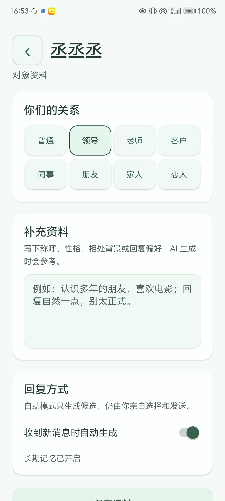
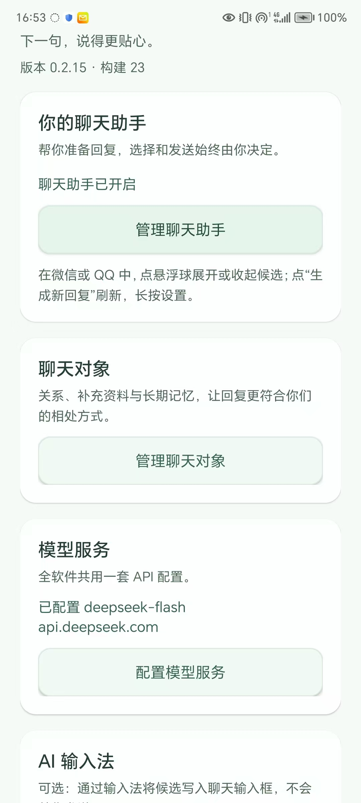
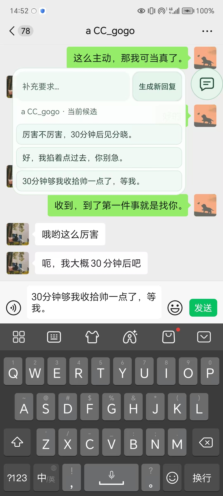
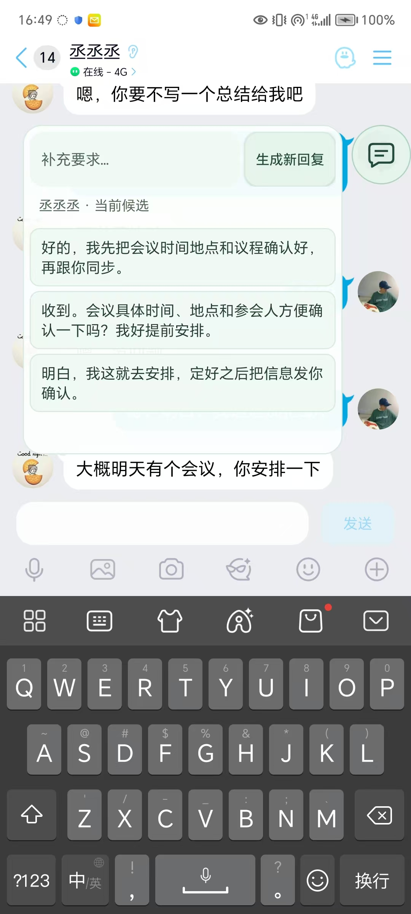

# NextSay（下一句）

NextSay 是一款运行在 Android 手机上的聊天回复助手。它在微信、QQ、TIM 等聊天页面中读取当前可见内容，在手机本地完成 OCR 和消息归属判断，再调用用户自己填写的 OpenAI 兼容 API 生成回复候选。

NextSay 只生成候选，不代替用户发送消息。用户可以选择候选并写入聊天输入框，检查无误后手动发送。

> 本项目为“源码公开、非商业许可”，不是 OSI 定义的宽松开源许可证。使用、复制、修改或再发布前，请阅读 [LICENSE](LICENSE)。

## 功能

- 支持微信、QQ、TIM 和 QQ 轻聊版的可见聊天页面。
- 支持手动生成，也支持按聊天对象开启自动生成候选。
- 可为不同聊天对象设置关系：普通、领导、老师、客户、同事、朋友、家人、恋人等。
- 可为对象填写称呼、性格、相处背景、回复偏好等补充资料。
- 每个聊天对象拥有独立的长期记忆和历史上下文。
- 恋人关系支持自然风格和黄毛风格等内置回复模式。
- 微信使用本机 OCR，并结合气泡颜色、位置和箭头方向判断消息来自哪一方；图片消息单独处理。
- QQ/TIM 优先使用无障碍节点读取文字，必要时回退到本机 OCR。
- 支持一套用户自己的 OpenAI 兼容 API URL、API Key 和模型配置。
- API Key 使用 Android Keystore 加密保存，不需要部署公网服务器。
- 诊断日志只保存在手机本地，可复制或导出，不记录 API Key、聊天原文或模型回答正文。
- 候选写入输入框后仍由用户确认和发送，不自动点击发送按钮。

## 界面展示

### 对象关系与补充资料

每个聊天对象可以独立设置关系和背景资料，让生成结果更贴合实际相处方式。



### 主界面与模型配置

主界面集中管理聊天助手、聊天对象和用户自己的模型服务配置。



### 候选回复浮窗

在聊天页面上通过悬浮窗查看多条候选，选择后写入输入框。



### 聊天页面中的悬浮回复

悬浮候选会保留在聊天页面上方，不改变原聊天记录，也不会替用户发送。



## 使用前提

- Android 11 或更高版本。
- 手机需要开启 NextSay 无障碍服务；如使用输入法写入候选，也需要启用 NextSay 输入法。
- 手机可以通过 Wi-Fi 或移动数据访问用户配置的模型 API。
- 每位用户自行填写自己的 API URL、API Key 和模型名称；项目作者不提供共享密钥。

## 快速开始

1. 安装并打开 NextSay。
2. 打开“配置模型服务”，填写 OpenAI 兼容 API 地址、自己的 API Key 和模型名称。
3. 点击“测试连接”，成功后保存配置。
4. 开启 NextSay 无障碍服务。
5. 在微信或 QQ 的一对一聊天中打开悬浮球，手动生成或为聊天对象开启自动生成。
6. 选择候选写入输入框，检查后由用户手动发送。

API 地址支持服务商基础地址或完整的 `/chat/completions` 地址。DeepSeek 官方地址可填写 `https://api.deepseek.com`，模型可填写 `deepseek-flash`。其他服务只要兼容 OpenAI Chat Completions 格式即可。

## 隐私边界

- 截图只在本机内存中处理，识别完成后释放，不上传原始截图。
- 只有用户请求生成候选时，识别出的文字、对象资料和必要的本地记忆才会发送到用户配置的模型服务。
- 微信、QQ 的账号、密码、私有数据库和通知内容不被读取。
- 聊天历史在本机加密保存；清空功能只删除 NextSay 保存的副本，不影响微信或 QQ 原聊天记录。
- 模型服务商对发送内容的处理受其自身隐私政策约束，请用户自行确认服务商可信度和费用。

## 构建

项目使用 Kotlin、Android Gradle Plugin、JDK 17 和 Android SDK 35。

```powershell
$env:JAVA_HOME = "D:\agent\codex\nextsay\.tools\jdk17\extracted\jdk-17.0.16+8"
.\gradlew.bat :android-app:testDebugUnitTest :android-app:assembleDebug
```

APK 输出路径：

```text
android-app/build/outputs/apk/debug/android-app-debug.apk
```

## 项目结构

```text
android-app/  Android 原生应用、悬浮窗、无障碍服务和测试
backend/      可选的旧版 FastAPI/代理基础设施
docs/         设计文档、实施记录和展示图片
releases/     本地构建的调试 APK（如存在）
```

Android 默认流程不依赖 `backend/`，手机直接访问用户填写的 API 地址。

## 免责声明

本软件按现状提供，不保证对所有 Android、微信、QQ、输入法版本持续兼容。用户必须遵守所在地法律法规、相关平台规则和模型服务商条款，并对自己的 API 费用、聊天内容和发送行为负责。

## 许可

本项目适用仓库根目录下的 [NextSay 非商业源码公开许可协议](LICENSE)。该协议保留著作权和商业授权，不授予商业部署、付费服务、广告变现、SaaS、重新发布 APK 或移除版权声明的权利。第三方依赖仍受其各自许可证约束。
